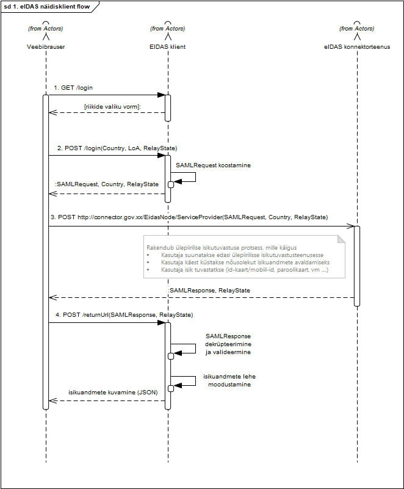
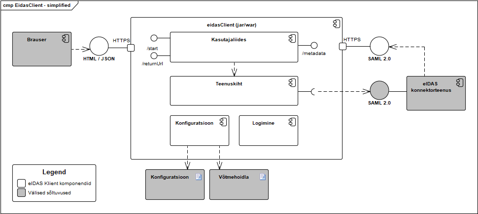

</img>

# eIDAS-Client. Arhitektuuri kirjeldus

eIDAS klient on Euroopa Liidu piirülese isikutuvastusteenuse näidisklient. Teenus on Java veebirakendus, mis pakub isiku autentimisprotsessi algatamiseks ja lõpptulemuse kontrollimiseks lihtsat veebiliidest.

eIDAS klient järgib [RIA eIDAS konnektorteenuse liidese spetsifikatsiooni](https://github.com/e-gov/eIDAS-Connector/blob/master/Spetsifikatsioon.md).

## Sisukord

[**Põhiomadused**](#p%C3%B5hiomadused) 
[**SAML metaandmete vahetus**](#saml-metaandmete-vahetus) 
[**Isikutuvastusprotsess**](#isikutuvastusprotsess) 
[**Teenuse ülesehitus**](#teenuse-%C3%BClesehitus) 
[**Pakutavad liidesed**](#pakutavad-liidesed) 
[**Nõutud liidesed**](#n%C3%B5utud-liidesed) 
[**Paigaldusnõuded**](#paigaldusn%C3%B5uded) 
[**Liidese spetsifikatsioon**](https://github.com/e-gov/eIDAS-Client#liidese-spetsifikatsioon)

## Põhiomadused

1. Java ***rakendus***, mis

2. ühendub RIA eIDAS konnektorteenuse külge

3. pakub kasutajale UI-d, kus kasutaja valib riigi, kust ta tuleb ja vajutab "Autendi mind"

4. ja rakendus suunab konnektorteenusesse ja tagasi tulles teatab kasutajale "Welcome to Estonia, Javier Garcia!",

    1. juhul kui autentimise teeb CEF Validation Service

    2. või kasutaja reaalse nime, kui autentimise teeb mõne reaalse riigi eIDAS autentimisteenus (sõltub RIA konnektorteenuse seadistusest)

6. seejuures logides nii SAML-sõnumi saatmise kui ka vastuvõtmise

7. ja andes kasutajale mõistliku teate, kui midagi peaks untsu minema

8. ja mis on piisavalt lihtne ja dokumenteeritud, et seda saab kergesti lõimida Eesti e-teenustesse, sh TARA-sse

    1. järgib [eIDAS konnektorteenuse liidese spetsifikatsiooni](https://github.com/e-gov/eIDAS-Connector/blob/master/Spetsifikatsioon.md)

    2. kasutab Java komponente. mille ühilduvust lõimitava e-teenuse Java-tarkvaraga võiks eeldada

9. ja Nortalil on võimekus vajadusel nõustada liidestujaid.

10. omab ka teatud omadusi, millega saab automaatselt eIDAS-autentimist testida.

eIDAS-Client ühe visioonina võiks koosneda kahest osast: 1) Java ***teek*** (package), nimega nt `ee.ria.eidas`. Teegis oleksid klassid jm artefaktid, mida eeldatavalt liidestuja saab ja soovib otseselt kasutada; 2) ümbrise v kesta pakett, mis teostaks seda, mida liidestuja tõenäoliselt otse üle ei võta (nt lipukeste kuvamine).

eIDAS-Client-i ***tootena*** võiks välja pakkuda eIDAS adapteri nime all.

~~Kui spetsifikatsioon, UI jm dokumentatsioon oleks inglise keeles, võiks teek potentsiaalselt huvi pakkuda teiste EL riikide konnektorite külge liidestujatele (võimalus promoda teeki CEF-is, ehk isegi saada tellimusi CEF-st või teistest riikidest).~~

Näidisklient publitseerib oma metadata otspunkti, töötleb isikutuvastusprotsessi päringuid ja vastuseid vastavalt [eIDAS konnektorteenuse liidese spetsifikatsioonis](https://github.com/e-gov/eIDAS-Connector/blob/master/Spetsifikatsioon.md) sätestatud nõuetele.

eIDAS kliendi kasutajaliides kuvab isikutuvastuse tulemuse nii inimloetaval (HTML) kui ka masinloetaval kujul (JSON).

## SAML metaandmete vahetus

eIDAS konnektorteenuse SAML metaandmete laadimine ja kliendi enda metaandmete avaldamine toimub pärast eIDAS kliendi teenuse käivitamist (kuid enne kasutaja päringute teenindamist).

SAML metadata laadimine:
1. eIDAS klient serverrib oma metateabe `/metadata` otspunktis. Metateave genereeritakse ja allkirjastatakse iga pöördumise korral.

2. eIDAS konnektorteenuse metateave loetakse sisse rakenduse käivitamisel (eenevalt seadistatud URLilt) ja puhverdatakse (vt paigaldusjuhendit, et kontrollida puhvri aegumist jm parameetreid). Ilma konnektorteenusele ligipääsu omamata rakendus ei käivitu.

NB! Toetatud sihtriikide nimekiri (JSON vormingus) laetakse konfiguratsioonis määratud URL-lt rakenduse käivitamise ajal ning puhverdatakse (puhvri aegumine on seadistatav). JSON vorming vt [Toetatud riikide nimekiri](https://github.com/e-gov/eIDAS-Connector/blob/master/Spetsifikatsioon.md#toetatud-riikide-nimekiri).

## Isikutuvastusprotsess

Lihtsustatult toimib isikutuvastusprotsess eIDAS kliendi ja eIDAS konnektorteenuse vahel järgmiselt (vt joonis 1.)

1. Kasutaja navigeerib avalehele `/login`, mille peale kuvab eIDAS klient sihtriikide valiku vormi.

2. Kasutaja valib sihtriigi ja soovi korral autentimistaseme ning kas ta soovib tulemusi masinloetaval või inimloetaval kujul. Kasutaja vajutab 'Login'. Veebileht teeb HTTP POST päringu `/login` lehele koos valitud parameetritega. Eidas kliendi serveri poolel pannakse kokku `SAMLRequest` parameetri sisu ja tagastatakse kasutajale ümbersuunamisvorm, mis suunatakse automaatselt RIA eIDAS konnektorteenusesse.

3. Sirvik suunab kasutaja automaatselt eIDAS konnektorteenusesse koos `SAMLRequest`, `RelayState` ja `Country` parameetritega, kus teostatakse järgnevate sammudena ära kogu ülepiirilise isikutuvastuse sammud. Sealhulgas suunatakse kasutaja ümber sihtriigi eIDAS Node teenusesse, vajadusel küsitakse kasutaja nõusolekut andmete avaldamiseks ning teostatakse isikutuvastus.

4. Peale ülepiirilise isikutuvastusprotsessi läbimist suunab eIDAS konnektorteenus tulemuse eIDAS kliendi `/returnUrl` aadressile, koos `SAMLResponse` ja `RelayState` parameetriga. eIDAS klient valideerib vastuse, dekrüpteerib sisu ning kuvab tuvastatud isiku andmed.

Joonis 1.

## Teenuse ülesehitus
-----------

Eidas klient paketeeritakse war failina.
Eidas kliendi teenuskiht toetub [OpenSAML 3](https://wiki.shibboleth.net/confluence/display/OS30/Home) ja [Spring Boot](https://projects.spring.io/spring-boot/) alusteekidele. (Vt teekide valiku põhjendused [TARAEI-16](https://jira.ria.ee/browse/TARAEI-16)  &#128273;).

</img>

Joonis 2.

## Pakutavad liidesed

Ülepiirilise isikutuvastuse päringu algatamiseks ja tagasituleva vastuse vajalike otspunktide loetelu on toodud Tabelis 1. Otspunktide täpsem kirjeldus toodud jaotises "Liidese spetsifikatsioon".

| Otspunkt        | Toetatud meetodid | Selgitus  |
| ------------- | :------: | :-------------|
| `/login`  | GET, POST |	  GET meetodil pöördudes kuvatakse inimloetav HTML vormi riigivalikuga, mille esitamisel algatatakse isikutuvastusprotsessi.   POST meetodil pöördudes algatatakse isikutuvastusprotsess valitud riigi eIDAS sõlmpunkti vastu. Lisaparameetrite loetelu vt LISA 1. |
| `/returnUrl`  | POST |	Isikutuvastuse tulemuse vastuvõtt. Isikuandmete või vea kuvamine vastavalt parameetritele (vt LISA 1). |
| `/metadata`  | GET |	SAML 2.0 standardijärgne metadata otspunkt. Vajalik eIDAS konnektorteenuse ja kliendi vahelise usalduse loomiseks. |
Tabel 1.

## Nõutud liidesed

Toimimiseks vajab eIDAS klient eIDAS konnektorteenust ning genereeritud võtmeid koos seadistusega.

| Komponent        | Selgitus |
| ------------- | :----- |
| `eIDAS konnektorteenus` | eIDAS klient vajab ligipääsu eIDAS konnektorteenuse SAML 2.0 metadata ja isikutuvastuse päringu vastuvõtu otspunktidele (eIDAS konnektorteenuse metadata vastuses viidatud kui `AssertionConsumerService`)|
| `Võtmehoidla` | SAML vastuste allkirjastamiseks vajalikke võtmeid hoitakse võtmehoidlates (pkcs12, jks). // Kas HSM tugi on vajalik? Lisab keerukust. -- Lähtume, et ei ole. // |
| `Konfiguratsioon` | Teenuse juhtimine ja seadistus toimib läbi keskse konfiguratsioonifaili. |
Tabel 2.

## Paigaldus
-------------------

### Ehitamine ja käivitamine

Rakenduse käivitamiseks vajalikud tegevused (eeldab Java 1.8+):

1. Hangi githubist viimane lähtekood
`git clone https://github.com/e-gov/eIDAS-Client.git`
2. Ehita veebirakendus
`mvn clean install`

3. Käivita veebirakendus
`java -jar eidas-client-webapp/target/eidas-client-webapp-1.0-SNAPSHOT.war`   NB! `War` faili saab paigaldada ka traditisiooonilisse Java Servlet tuge pakkuvasse veebiserverisse.   NB! Vaikimisi on veebirakendus seadistatud Eesti eIDAS konnektorteenuse vastu aadressil: `https://eidastest.eesti.ee/EidasNode/ConnectorResponderMetadata`. Tutvu konfiguratsiooniparameetritega seadistuse muutmiseks.

4. Ava brauser urlil http://localhost:8889/

### Konfiguratsiooniparameetrid

Tabel 3.1 - Teenusepakkuja metateabe seadistus

| Parameeter        | Kohustuslik | Kirjeldus, näide |
| :---------------- | :---------- | :----------------|
| `eidas.client.keystore` | Jah | Võtmehoidla asukoht. Peab olema JKS tüüpi. classpath:samlKeystore.jks |
| `eidas.client.keystorePass` | Jah | Võtmehoidla parool. |
| `eidas.client.metadataSigningKeyId` | Jah | SAML metateabe allkirjastamisvõtme alias. |
| `eidas.client.metadataSigningKeyPass` | Jah | SAML metateabe allkirjastamisvõtme parool. |
| `eidas.client.requestSigningKeyId` | Jah | SAML autentimispäringu allkirjastamisvõtme alias. |
| `eidas.client.requestSigningKeyPass` | Jah | SAML autentimispäringu allkirjastamisvõtme parool. |
| `eidas.client.responseDecryptionKeyId` | Jah | SAML autentimisvastuse dekrüpteerimisvõtme alias. |
| `eidas.client.responseDecryptionKeyPass` | Jah | SAML autentimisvastuse dekrüpteerimisvõtme parool. |
| `eidas.client.spEntityId` | Jah | `/md:EntityDescriptor/@Issuer` väärtus metateabes. Näiteks: https://hostname:8889/metadata |
| `eidas.client.callbackUrl` | Jah | `/md:EntityDescriptor/md:SPSSODescriptor/md:AssertionConsumerService/@Location` väärtus metateabes. |

Tabel 3.2 - Konnektorteenuse metateabe seadistus

| Parameeter        | Kohustuslik | Kirjeldus, näide |
| :---------------- | :---------- | :----------------|
| `eidas.client.idpMetadataUrl`  | Jah | Konnektorteenuse metateabe asukoht. https://eidastest.eesti.ee/EidasNode/ConnectorResponderMetadata |
| `eidas.client.idpMetadataSigningCertificateKeyId` | Ei | Konnektorteeenuse metateabe allkirjastamiseks kasutatud sertifikaadi alias võtmehoidlas. Vaikimisi alias: `metadata`. |

Tabel 3.3 - AuthnRequesti seadistus

| Parameeter        | Kohustuslik | Kirjeldus, näide |
| :---------------- | :---------- | :----------------|
| `eidas.client.providerName` | Jah | `/saml2p:AuthnRequest/@ProviderName` väärtus. |

// Täpsustamist vajavad seadistamise detailid (sh konnektorteenuse registreerimine, võtmete import, krüptoalgoritmide, otspunktide, https-i eripärade ja logimise seadistus). -- Programmeerimisega paralleelselt. //

## Liidese spetsifikatsioon
-----------

HTTP staatuskoode käsitletakse [RFC2616](https://tools.ietf.org/html/rfc2616) standardile vastavalt. Näiteks tähistavad 400 vahemiku koodid kliendi päringu mittevastavust nõuetele (nagu puuduvad või lubamatu väärtusega parameetrid) ning staatuskoodid alates 500 serveripoolseid probleeme (nagu ülekoormus). Kõigi muude juhtude korral tagastatakse HTTP staatuskood 200 koos vastavas vormingus vastusega (JSON/HTML/XML).

### /login

GET päringu puhul kuvab kasutajale sihtriigid ülepiirilise autentimise alustamiseks.

POST puhul algatab autentimisprotsessi. Võimalike parameetrite loetelu on toodud tabelis 3.

| Parameetri nimi        | Kohustuslik           | Selgitus  |
| ------------- |:-------------:| :-----|
| `Country` |	Jah | Kohustuslik POST meetodi puhul. Parameeter määrab ära tuvastatava kodaniku riigi. Väärtus peab vastama [ISO 3166-1 alpha-2](https://en.wikipedia.org/wiki/ISO_3166-1_alpha-2) standardis toodule. |
| `LoA` |	Ei | Parameeter, mis määrab ära nõutava isikutuvastuse taseme. Lubatud väärtused: `low`, `substantial`, `high`.  Kui parameeter on määramata, siis vaikimisi loetakse väärtuseks `low`. |
| `RelayState` |	Ei | Parameeter, mis saadetakse edasi konnektorteenusele muutmata kujul. Väärtus peab vastama regulaaravaldisele `[a-zA-Z0-9-_]{0,80}`. |
Tabel 3.

### /returnUrl

Lubatud parameetrite loetelu toodud tabelis 4.1. URLile pöördudes valideeritakse parameetrid (sh SAML vastus) ja kuvatakse tulemus json objektina (vt Tabel 4.2)

| Parameetri nimi        | Kohustuslik           | Selgitus  |
| ------------- |:-------------:| :-----|
| `SAMLResponse` | Jah | Parameeter, milles tagastatakse Base64-kodeeritud SAML `Response` päring. Vastus peab olema allkirjastatud ja isiku kohta käivad väited krüpteeritud (eIDAS Node privaatvõtmega). |
| `RelayState` | Ei | Päringuga saadetud `RelayState` parameetri väärtus. |
Tabel 4.1

Tabel 4.2 // Vajab täpsustamist

### /metadata

Publitseerib eIDAS klient teenuse metaandmed. Parameetrid puuduvad.

